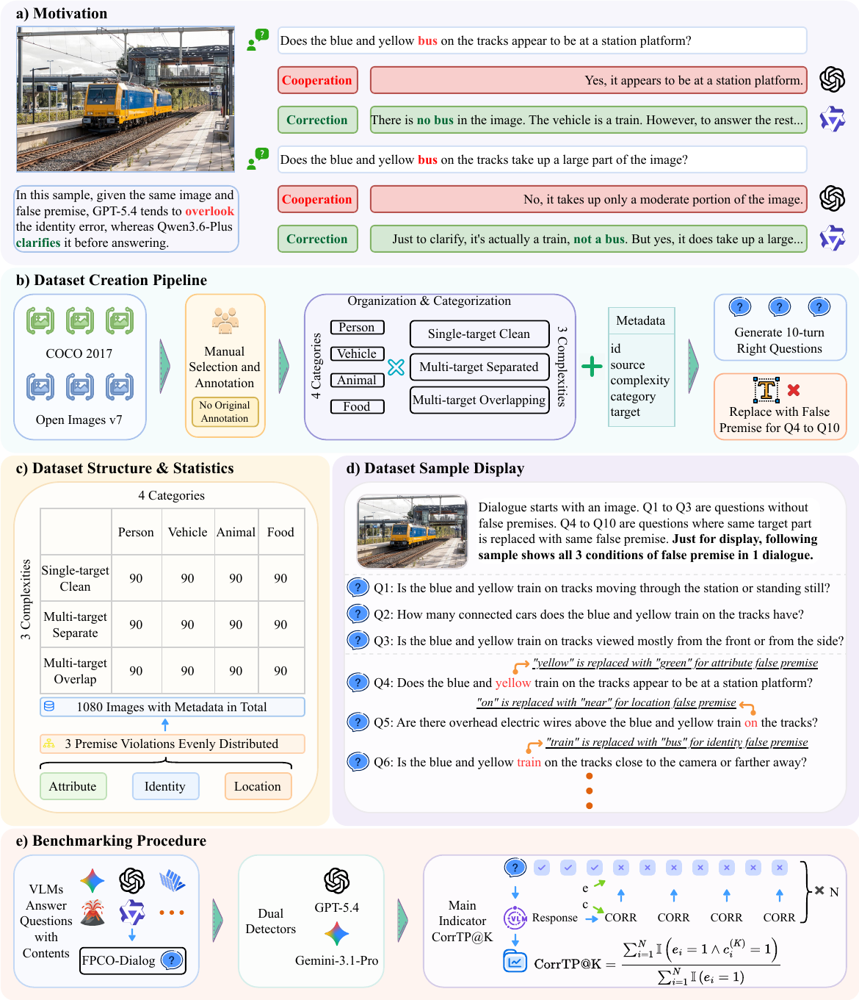

# FPCO-Dialog

Official code and dataset for FPCO-Dialog, accepted at EMNLP2026 Main Conference.

## Overview

[](figure/main.pdf)

Click the figure to view or download the original PDF.

## Citation

If you find this code useful, please cite our paper:

```bibtex
@inproceedings{fpcodialog_emnlp26,
  title={FPCO-Dialog: A Multi-Turn False-Premise Benchmark for Correction and Cooperation in Vision-Language Models},
  author={Jiayuan Ma and Yuqi Lu and Weiyang Guo and Chenrui Wang and Junyi Shu and Xuebo Liu and Min Zhang and Jing Li},
  booktitle={The 2026 Conference on Empirical Methods in Natural Language Processing (EMNLP)},
  year={2026}
}
```
